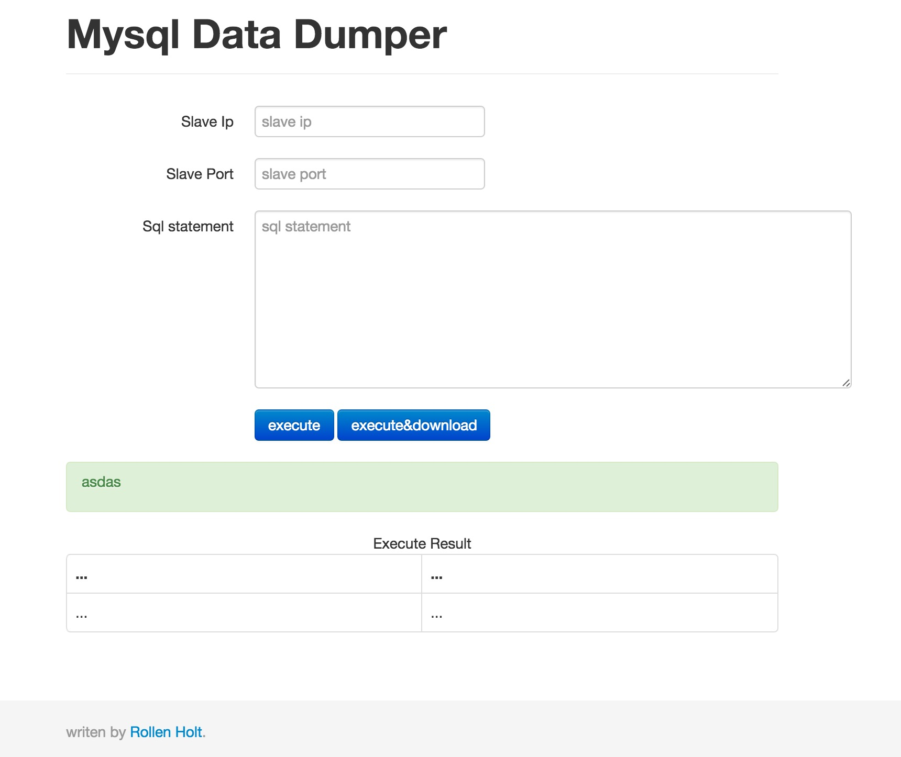

# mysql data dumper

## 痛点

实际工作中我们往往都会有很多的应用系统,每个应用系统都会有自己的数据库实例,这些数据库实例可能
往往并不在一台机器上.
同时企业为了安全起见都不容许开发者的本地机器直接访问线上的数据库实例,一般都会有访问白名单
随着数据库实例的越来越多,开发每次都需要寻找实例对应的`JDBC`连接信息

## 项目目标

- 统一维护数据库实例的JDBC连接
- 统一数据导出工具和页面
- 提升数据导出效率
- 减轻开发成员的负担

## UI 展示

## 功能列表

- 统一维护的JDBC连接信息
- 简单的实用的sql过滤,避免恶意sql
- 数据的导出
- 数据的导出同时下载为CSV格式的文件